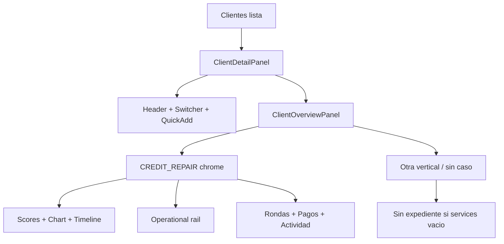

# 01 — J&H CRM: estado actual (código en main)

> Auditoría de investigación. Fuente de verdad: código en `main` (prioridad sobre docs históricos).  
> Fecha: 2026-09-21. No modifica código de producción.

## Resumen ejecutivo

J&H es un CRM multi-tenant de **J&H Multiservices** centrado en **reparación de crédito**, con arquitectura v1 (Client → ServiceCase → CreditCase) **ya materializada en código**. Client 360 V2 ya está desplegado en composición. Los mayores huecos de producto no son “faltan tablas”, sino **features escritas pero no legibles en UI** (intake) y **flujos de alta sin guía de servicio**.

## Documentación vs código

| Documento | Estado |
|-----------|--------|
| `ARCHITECTURE_V1.md` | **Vigente** |
| `02-BUSINESS_RULES.md` | **Vigente** |
| `CLIENT_360_V2_PLAN.md` | **Vigente** (implementado en gran parte) |
| `CURRENT_STATE.md` | **Superado** — afirma que ServiceCase no existe; el código sí lo tiene |
| `GAP_ANALYSIS.md` | **Histórico / parcialmente vigente** |
| `MIGRATION_PLAN.md` | **Parcialmente vigente** — verificar qué deploy ya corrió en prod |

## Stack

- Next.js App Router + React + TypeScript
- Prisma + MySQL (Hostinger típico)
- NextAuth v5, permisos por rol
- Server Actions + `src/server/*` dominio
- S3-compatible storage, Stripe, Whapi, OpenRouter AI
- UI propia (`src/components/ui`), SVG charts propios (no Recharts)

## Dominio real (Prisma)

```text
Organization / User / OrganizationMember (role enum)

Client                          persona (status LEAD|ACTIVE|…)
  ├── Opportunity[]             pipeline comercial = “Leads” en producto
  ├── ServiceCase[]             expediente contratado
  │     ├── stageId → WorkflowStage (por Service)
  │     ├── nextActionAt
  │     ├── Task / Document / Note / Payment / Quote
  │     └── CreditCase?         1:1 si service.code = CREDIT_REPAIR
  │           ├── CreditReport → CreditBureauSnapshot, CreditItem
  │           ├── CreditRound → DisputeItem
  │           ├── Letters, Comparisons, ProgressReports
  ├── Note[]
  ├── Task[]
  ├── IntakeLink[] → IntakeSubmission (payloadJson)
  └── ActivityLog[]
```

**No existe tabla `Lead`.** Prospecto = `Client` + opcionalmente `Opportunity`.

## Qué funciona bien

| Área | Evidencia |
|------|-----------|
| Multi-service | `ClientServiceSwitcher`, overview scoped por `caseId` |
| Credit Repair | Reportes, scores EXP/EQX/TU, rondas, disputes, letters, PDF import |
| Client 360 V2 | Layout 8/4, rail, peeks reporte/ronda/pago, chart SVG, scores unificados |
| Pagos | Quote balance, Stripe checkout, peeks, métodos manuales |
| Notas | Tabla `Note` separada de `ActivityLog` (BR-021) |
| Docs checklist | `getChecklistForService` + resumen en overview |
| Auth / permisos | Guards + `can(role, permission)` |

## Qué está parcial

| Área | Qué falta |
|------|-----------|
| Intake | Write completo; **sin UI staff para `payloadJson`** |
| Alta cliente | Crea persona; no guía servicio → empty “Sin expediente” |
| markWon | Transaccional OK; **hardcode CREDIT_REPAIR** |
| Tareas lead | Web/Meta crean tarea genérica; CRM `createLead` no crea tarea |
| Balance expediente | Vive sobre Quote; no `ServiceCase.agreedAmount` maduro |
| `serviceRequested` | Texto libre; no alimenta conversión ni detalle de tarea |

## Qué no tocar

- Modelo ARCHITECTURE_V1 (envolver CreditCase, no renombrar)
- Módulo Credit Repair operativo
- Chart SVG / peeks existentes
- Connection strategy MySQL (salvo ticket dedicado)

## Flujo Client 360 (actual)



### Componentes clave

- `src/server/clients/overview.ts` — `getClientOverview`
- `src/components/clients/client-detail-panel.tsx`
- `src/components/clients/client-overview-panel.tsx`
- `src/components/clients/client-operational-rail.tsx`
- `src/components/clients/client-credit-workspace.tsx`
- Peeks: `report-peek-modal`, `round-peek-modal`, `payment-peek-modal`

## Intake (hallazgo crítico)

```text
Generar link → IntakeLink
Cliente completa → IntakeSubmission.payloadJson
                 + update Client
                 + Documents
                 + ConsentRecord
                 + Notification → /crm/clientes/{id}

UI Accesos e integraciones: solo estado del link (useCount)
UI Resumen / 360: NO lee payloadJson
```

Archivos: `src/server/intake/index.ts`, `src/components/intake/create-intake-link-card.tsx`, `app/intake/[token]/`.

## Alta cliente y “Sin expediente”

```text
createClient → Client (LEAD) solo
getClientOverview → services=[] → activeService=null
ClientOverviewPanel → “Sin expediente” + CreateCaseButton
ClientServiceSwitcher → null si 0 servicios
```

Expediente aparece vía `createServiceCase` o `markWon` (hoy siempre CREDIT_REPAIR).

## Tareas de lead (hallazgo crítico)

| Origen | Tarea auto | Título |
|--------|------------|--------|
| Web contact / Meta | Sí (`onNewLead`) | `Seguimiento: Nuevo lead` |
| CRM `createLead` | **No** | — |
| Opp con `nextFollowUpAt` | Sí | `Contactar · Nombre (código)` |

Dashboard “Para hacer”: título genérico; nombre solo en subtítulo. Detalle de tarea: Completar/Cancelar; sin “qué necesita”.

## Performance (estado)

- Overview usa `Promise.all`, peeks on-click, hover local.
- Riesgo residual: `getCaseCreditOverview` puede cargar reportes densos.
- Histórico de timeouts Prisma / MySQL en serverless — no empeorar queries del hub.

## Conclusión

El producto tiene **núcleo crediticio y Client 360 sólidos**. La siguiente prioridad de producto no es otro rewrite: es **hacer visibles datos ya guardados** (intake), **guiar el servicio al abrir expediente**, y **hacer accionables las tareas de lead**.
